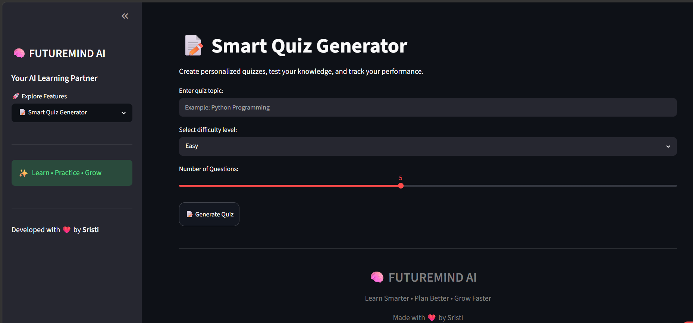

<p align="center">
  
</p>

<h1 align="center">🧠 FUTUREMIND AI</h1>

<p align="center">
An AI-Powered Study & Career Assistant
</p>

<p align="center">


</p>

## 🌐 Live Demo

👉 **[Try FUTUREMIND AI](https://futuremindai-nhw6kdehygcwx8jsai3rct.streamlit.app/)**

An AI-powered Study & Career Assistant designed to help students learn smarter, practice effectively, and prepare for their future.

---

## 🚀 Features

- 📚 AI Study Tutor
- 📝 Smart Quiz Generator
- 🚀 Career Roadmap Generator
- 📊 Skill Gap Analyzer
- 🎤 AI Mock Interview
- 📈 Analytics Dashboard
- 📄 PDF Export

---

## 🛠️ Tech Stack

- Python
- Streamlit
- Generative AI
- Plotly
- Pandas
- ReportLab
- JSON

---

## 📸 Screenshots

### 🏠 Home


### 📚 AI Study Tutor


### 📝 Smart Quiz Generator



### 🚀 Career Roadmap


### 📊 Skill Gap Analyzer


### 🎤 AI Mock Interview


### 📈 Analytics Dashboard


---

## ⚙️ Installation

Clone the repository:

```bash
git clone https://github.com/shawsristi13/FUTUREMIND_AI.git
```

Install dependencies:

```bash
pip install -r requirements.txt
```

Run the application:

```bash
streamlit run app.py
```

---

## 📂 Project Structure

```text
FUTUREMIND_AI
│
├── modules
├── utils
├── screenshots
├── app.py
├── requirements.txt
├── README.md
└── .gitignore
```

---

## 🎯 Future Improvements

- User Login System
- Cloud Database
- Leaderboard
- Personalized Learning Plans
- Mobile Application
- Voice-based AI Tutor

---

## 👩‍💻 Author

**Sristi Shaw**

GitHub:
https://github.com/shawsristi13

LinkedIn:
(Add your LinkedIn profile link here)

---

⭐ If you like this project, consider giving it a Star!
